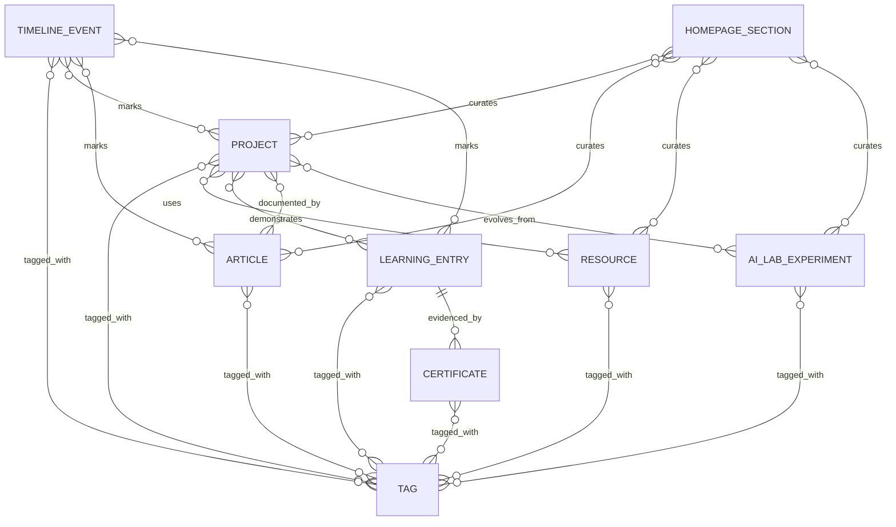

# Release Orion — Content Engine Architecture

**Status:** architecture proposal only. No runtime, schema, UI, route, SEO, API, localization, or Supabase changes are included in this release.

## 1. Decision

ZealCoder will use a content engine with one canonical record for each piece of domain content and separate localized fields for visitor-facing copy. Pages and components may choose *how* to display records, but may not define the records, editorial copy, external profile URLs, or homepage selections they display.

The initial source of truth remains repository-managed content. A future CMS writes to the same contracts; it does not require a second frontend model.

### Shared conventions

All entities use these fields unless an exception is stated:

| Field | Purpose |
| --- | --- |
| `id` | Stable UUID/internal identifier. Never use a title as identity. |
| `slug` | Stable, URL-safe public identifier; immutable after publishing or preserved with redirects. |
| `status` | Editorial lifecycle: `draft`, `published`, `archived`. Draft is never rendered publicly. |
| `publishedAt` | ISO-8601 datetime; required to publish. |
| `featured` | Explicit editorial flag, never inferred from array position. |
| `featuredOrder` | Optional integer; lower values appear first among featured records. |
| `sortOrder` | Optional integer for curated order; otherwise use the entity's documented default. |
| `tags` | Many-to-many tag references, not an array of arbitrary display strings. |
| `locale` / translations | `en` and `tr` copy is stored per field. A missing translation falls back to the default locale in authoring preview only; public publishing requires both locales for required public copy. |
| `createdAt`, `updatedAt` | Audit fields. |

`future` is a planning state, not a public publishing state. It is represented as `visibility: "future"` on the entities that need it. It is excluded from public queries until a future UI intentionally supports it.

### Reusable value objects

```ts
type LocalizedText = { en: string; tr: string };
type LocalizedRichText = { en: PortableDocument; tr: PortableDocument };
type Link = { label?: LocalizedText; url: string; kind: "github" | "kaggle" | "medium" | "demo" | "documentation" | "video" | "verification" | "external" };
type Publication = { status: "draft" | "published" | "archived"; publishedAt?: string; featured?: boolean; featuredOrder?: number; sortOrder?: number; visibility?: "public" | "future" };
```

`PortableDocument` deliberately means a CMS-neutral rich-text AST or Markdown body. The renderer converts it to safe HTML at the edge; raw HTML is not stored as content.

## 2. Content audit

### Existing content sources

| Domain | Current source | Assessment |
| --- | --- | --- |
| Global UI copy, about copy, legacy section copy | `src/data/content.js` | Localized but mixes interface labels with editorial/profile content. |
| Curated projects/case studies | `src/data/projects.js` | Good localized project detail basis; lacks lifecycle, stable slug naming, featured flag/order, dates, cover/media, and relation fields. |
| Resources | `src/data/resources.js` | Localized description/type, but no IDs, taxonomy, lifecycle, authoring metadata, or ordering policy. |
| Learning / skills | `src/data/skills.js` | Uses self-assessed percentages; English-only and not a learning-entry model. |
| Certificates | `src/data/certificates.js` | Flat title/issuer/date records; lacks credential ID, verification URL, normalized date, and lifecycle. |
| AI Lab | `src/data/aiLab.js` | Localized status/description but lacks identity, lifecycle, outcomes, links, and project/article relations. |
| Timeline | `src/components/CareerTimeline.jsx` | Entire timeline is component-owned. |
| Homepage editorial content and composition | `src/components/PortfolioHub.jsx` | Component-owned bilingual copy, current focus cards, learning stages, writing placeholder, external URLs, and `projects[0]` selection. |
| Hero editorial content and social profiles | `src/components/Hero.jsx` | Component-owned bilingual copy and social URLs. |
| About focus cards | `src/components/About.jsx` | Component-owned English content and labels. |
| Contact/social links | `src/components/Contact.jsx`, `src/components/Footer.jsx` | Component-owned profile and email data; duplicated profile URLs. |
| Updates | `src/data/updates.js`, `src/data/manualUpdates.js`, Supabase admin + automatic GitHub/Medium fetches | Three competing representations. Automatic updates are integration output and must remain separate from editorial records. |
| GitHub projects | `src/lib/github.js` | External-source projection, not a replacement for curated project records. |

Additional hardcoded editorial/marketing copy remains in `HomePreview.jsx`, `HomeWork.jsx`, `RecruiterPanel.jsx`, `Terminal.jsx`, `Dashboard.jsx`, `ProjectsPageContent.jsx`, `UpdatesPageContent.jsx`, and `UpdatesSection.jsx`. Labels that are purely UI controls may stay with localized UI copy, but page intros, claims, CTAs, profile addresses, and collection choices should move to the content engine over subsequent releases.

### Weaknesses to address

1. **Ownership is inconsistent.** `PortfolioHub.jsx` is both a renderer and a content store; changing a sentence or featured item requires UI code edits.
2. **Featured selection is fragile.** `projects[0]` encodes editorial priority in array position and can silently change with reordering.
3. **Localization is incomplete.** `skills.js` and several component-local blocks are English-only; several records use separate `titleTr` fields while others use `{ en, tr }`.
4. **Lifecycles are absent.** Existing local records cannot safely be drafted, scheduled, archived, or excluded from public data.
5. **Relationships are implicit.** Projects, articles, learning entries, certificates, experiments, and resources cannot refer to one another in a consistent way.
6. **Duplicate profile data risks drift.** GitHub, Medium, Kaggle, LinkedIn, and email values occur in several components.
7. **External feeds and curated content are conflated.** GitHub/Medium update ingestion should enrich an activity feed, not become the canonical project/article model.

## 3. Entity models

### Project

Represents a curated case study or build. A GitHub repository may be linked, but does not create a project automatically.

| Required | Optional | Relationships / behavior |
| --- | --- | --- |
| `id`, `slug`, `title`, `summary`, `status`, `publishedAt` when published, `projectState`, `tags` | `coverImage`, `body`, `problem`, `approach`, `outcome`, `metrics`, `links`, `repository`, `startedAt`, `completedAt`, `featured`, orders | `resources`, `learningEntries`, `articles`, `experiments`, and `timelineEvents` may reference the project. |

`projectState`: `draft`, `published`, `archived`, `future`. `status` retains the shared editorial lifecycle; `projectState` expresses the requested project roadmap state. Valid public combinations: `published/published`, `published/archived`. `future` must be `draft` until a public roadmap experience is deliberately introduced.

### Article

Represents a writing item regardless of host.

| Required | Optional | Relationships / behavior |
| --- | --- | --- |
| `id`, `slug`, `title`, `excerpt`, `source`, `status`, `publishedAt` when published, `tags` | `body`, `canonicalUrl`, `externalUrl`, `coverImage`, `readingTimeMinutes`, `series`, `featured`, orders | `source`: `native`, `medium`, `external`. Native requires `body`; Medium/external requires `externalUrl`; canonical URL prevents duplicate SEO when native copies or mirrors exist. May relate to projects, resources, learning entries, and experiments. |

### Resource

Represents a durable recommendation or reference, not a transient update.

| Required | Optional | Relationships / behavior |
| --- | --- | --- |
| `id`, `slug`, `title`, `kind`, `url`, `status`, `tags` | `description`, `authorOrPublisher`, `publishedYear`, `image`, `featured`, orders, `access` | `kind`: `book`, `course`, `video`, `github`, `research-paper`, `tool`, `documentation`, `dataset`, `other`. May support a project/article/learning entry. |

### Learning entry

Represents an intentional learning outcome or active plan, replacing skill percentages as the primary learning record.

| Required | Optional | Relationships / behavior |
| --- | --- | --- |
| `id`, `slug`, `title`, `state`, `summary`, `tags`, `sortOrder` | `provider`, `startedAt`, `completedAt`, `estimatedCompletionAt`, `evidenceLinks`, `reflection`, `featured` | `state`: `completed`, `current`, `planned`. Links to resources, certificates, projects, and timeline events. Skills can later be derived from tagged evidence rather than self-assessed percentages. |

### Certificate

| Required | Optional | Relationships / behavior |
| --- | --- | --- |
| `id`, `slug`, `title`, `organization`, `issueDate`, `status` | `credentialId`, `verificationUrl`, `expirationDate`, `image`, `relatedLearningEntry`, `featured`, orders | Issue and expiry are ISO dates (`YYYY-MM-DD`), not presentation strings. A verification URL is shown only when publicly shareable. |

### Timeline event

| Required | Optional | Relationships / behavior |
| --- | --- | --- |
| `id`, `occurredAt`, `title`, `summary`, `status`, `tags` | `slug`, `endDate`, `kind`, `featured`, orders, `relatedEntityRefs` | `kind`: `education`, `career`, `learning`, `project`, `publication`, `milestone`. Events can reference any entity through `relatedEntityRefs`. Default order is `occurredAt DESC`; a journey view may request ascending order. |

### AI Lab experiment

| Required | Optional | Relationships / behavior |
| --- | --- | --- |
| `id`, `slug`, `title`, `experimentState`, `summary`, `status`, `tags` | `hypothesis`, `method`, `findings`, `limitations`, `links`, `startedAt`, `completedAt`, `featured`, orders | `experimentState`: `idea`, `planned`, `in-progress`, `completed`, `paused`. Projects and articles can document an experiment; only public/published records are rendered. |

### Social link

| Required | Optional | Relationships / behavior |
| --- | --- | --- |
| `id`, `platform`, `url`, `visibility`, `sortOrder` | `label`, `handle`, `featured`, `iconKey` | `platform`: `github`, `linkedin`, `medium`, `kaggle`, `email`, `website`, `other`. `visibility`: `public`, `contact-only`. This is the sole profile-link source for hero, footer, and contact. |

### Supporting entities

`Tag` (`id`, `slug`, localized `name`, optional localized `description`) is shared taxonomy. `MediaAsset` (`id`, `url`, alt text, dimensions, attribution) protects accessibility and makes covers reusable. `HomepageSection` is configuration, not a new page model: `key`, `enabled`, localized heading/subheading, `query`, `limit`, and optional curated entity references. It separates editorial placement from React layout.

## 4. Entity relationship diagram



Relationship tables should contain `sourceId`, `targetId`, `relationType`, `sortOrder`, and timestamps. A polymorphic `relatedEntityRefs` convenience field may be useful in a document CMS, but relational storage should preserve referential integrity with join tables.

## 5. Homepage as renderer

The homepage owns layout and presentation only. Its server-side content adapter receives a `HomepageViewModel` assembled from published records.

| Homepage section | Content query/configuration | No component-owned content |
| --- | --- | --- |
| Hero | `siteProfile` + public `socialLinks` + `homepage.hero` copy | Identity, narrative, links, and CTA targets |
| Current Focus | `homepage.currentFocus` curated refs or query for `learningEntry.state=current`, `experimentState=in-progress`, plus one project/article | Card labels, descriptions, ordering, destinations |
| Featured Project | `Project(status=published, featured=true)` ordered by `featuredOrder`, limit 1 | Never `projects[0]` |
| Learning Journey | `LearningEntry` grouped by state, or curated `HomepageSection` references | Stage text and order |
| Latest Writing | `Article(status=published)` ordered by `publishedAt DESC`, optionally featured first; include Medium/native uniformly | Medium placeholder/card data |
| Resources | `Resource(status=published, featured=true)` then `sortOrder`, limit configured | Resource selection/count |
| AI Lab | `AI_LAB_EXPERIMENT(status=published)` ordered by feature/order or recency | Experiment labels and status |
| Final CTA | `homepage.finalCta` copy + `socialLinks`/route target configuration | CTA copy and external profile URL |

The page can retain its current React components. A later migration changes imports and props so they render a view model; it does not change routes or visual design.

## 6. Migration strategy

1. **Freeze contracts (this release).** Adopt the models and naming rules in this document. Do not alter existing data or Supabase.
2. **Create a repository adapter.** In a later, isolated release, introduce a `src/content/` read layer that maps existing `src/data/*` records to the new contracts. Preserve exports as compatibility shims until each consumer migrates.
3. **Normalize incrementally.** Add IDs, slugs, ISO dates, localized fields, explicit status, featured flags, sort order, and tags. Convert `projects[0]` into an explicit featured project only after confirming the intended record.
4. **Move component-owned editorial content.** Migrate Hero, PortfolioHub, CareerTimeline, About focus, contact profiles, and footer links to `siteProfile`, `homepage`, `timelineEvents`, and `socialLinks`, section by section. UI labels may remain in `content.js` until a dedicated UI-copy strategy is approved.
5. **Add validation and preview.** Validate every repository content record in CI: unique IDs/slugs, valid URLs/dates/enums, required localizations, valid links, and at most one primary featured project per slot. Add draft preview before enabling public draft management.
6. **Introduce storage behind the adapter.** Only after reads are stable, create Supabase tables or CMS documents and backfill from the validated repository data. Keep current Supabase admin updates untouched; it is a separate activity-feed concern.
7. **Switch read source with a feature flag.** Compare repository and CMS output in preview/staging, migrate one entity type at a time, and retain rollback to the repository adapter. Do not dual-write without an explicit reconciliation policy.

## 7. Future CMS strategy

**Recommended shape:** a headless CMS or Supabase-backed editorial API behind the same `src/content` adapter.

- Use the repository as the first authoring surface while content volume is low and code review is valuable.
- Add CMS authoring when drafts, scheduled releases, media management, or non-code editorial workflows are genuinely needed.
- Preserve Supabase for authenticated/admin and platform data. A CMS may be a separate editor, but it must not leak directly into React components.
- Require role-based publishing, draft preview, immutable audit history, media alt text, locale completeness checks, and webhook-triggered revalidation.
- Store media in an asset service/storage bucket; store metadata and alt text in the content layer.
- Model external GitHub/Medium ingestion as read-only integration records. Editors can link or promote them into canonical projects/articles, never rely on ingest data as the content source of truth.

CMS selection is intentionally deferred. The stable contracts, adapter boundary, validation rules, and localization requirements matter more than the vendor.

## 8. Implementation roadmap

| Release | Outcome | Guardrail |
| --- | --- | --- |
| Orion-A (complete) | Architecture, audit, entity contracts, ERD, migration plan | Documentation only. |
| Orion-B | Repository content adapter, schema validation, canonical localized fixtures | No UI changes; legacy exports remain compatible. |
| Orion-C | Migrate projects, resources, certificates, learning entries, and AI Lab to contracts | Preserve present page output and routes. |
| Orion-D | Migrate site profile, social links, timeline, and homepage section configuration | Homepage becomes a pure renderer; no visual redesign. |
| Orion-E | Draft preview and publish workflow; CMS/Supabase content storage decision | Keep existing admin updates independent. |
| Orion-F | Native article publishing, external article sync/promotions, related-content queries | Preserve canonical/SEO controls. |

## 9. Release self-review

- No production files were modified.
- Existing routing, localization, Supabase clients/admin, SEO metadata, APIs, and business logic remain untouched.
- The proposed contracts explicitly support TR/EN, draft/published/archive, future planning, featured ordering, tags, relationships, and a CMS without coupling UI to a vendor.
- The next implementation release should be **Orion-B: repository content adapter and validation**, because it creates a safe canonical boundary before any component migration.
