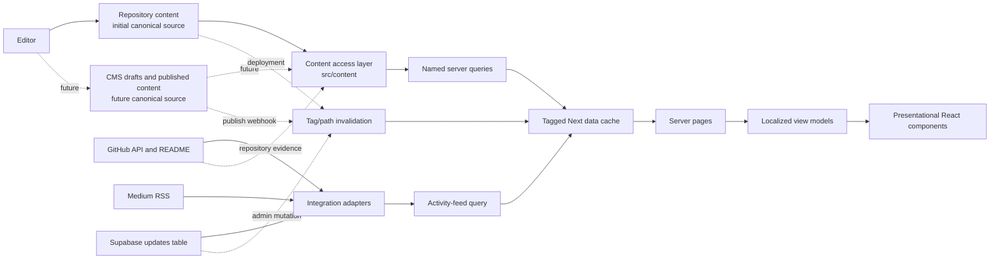

# Release Constellation — Content Source Strategy

**Status:** architectural documentation only. No data, UI, routing, business logic, Supabase schema, environment value, or integration has been changed.

## 1. Architecture decision

ZealCoder will use a **content access layer** as the only path from content sources to React. A component receives a typed view model or calls a named content query; it never imports a raw fixture, reads a CMS client, calls an external API, or encodes editorial selection.

For the initial phase, repository-managed content is the canonical source for platform content. A future CMS becomes the canonical authoring store behind the same content access layer. The source changes once, in one adapter—not across pages and components.

External platforms remain authoritative only for their own external facts (for example, GitHub repository metadata and a Medium-hosted article URL). They are not the source of truth for ZealCoder's curated content, copy, taxonomy, status, or homepage placement.

## 2. Current content source map

| Source class | Current locations | Current responsibility | Architectural assessment |
| --- | --- | --- | --- |
| Static domain content | `src/data/projects.js`, `resources.js`, `skills.js`, `certificates.js`, `aiLab.js` | Curated projects, resources, skills, certificates, AI Lab cards | Useful seed data, but each file has a different contract and no shared access layer. |
| Static copy/constants | `src/data/content.js`, `stats.js`, `updates.js`, `manualUpdates.js`, `assistantKnowledge.js` | UI copy, legacy content, stats, manually seeded updates, AI knowledge | Some are content; some are UI configuration or AI prompt material and should not be treated as one category. |
| Component-local content | `PortfolioHub.jsx`, `Hero.jsx`, `CareerTimeline.jsx`, `About.jsx`, `Contact.jsx`, `Footer.jsx`, `Navbar.jsx`, and the additional components listed in Orion | Homepage content, profiles, timeline, calls to action, navigation labels | Content ownership leak. `PortfolioHub.jsx` currently contains `projects[0]`, an array-position selection rule. |
| Supabase | `updates` table through `src/app/api/updates/route.js` and admin routes/pages | Admin-authenticated activity/update records | The live source of truth for manual activity updates only. It is not currently a source for projects, articles, or other core entities. |
| External GitHub API | `src/lib/github.js`, `src/lib/updates/getAutomaticUpdates.js` | Repository discovery, README front matter, repository activity | Read-only integration/projection. GitHub repository metadata and README front matter are useful evidence, not canonical curated project data. |
| External Medium RSS | `src/lib/updates/getAutomaticUpdates.js` | Recent Medium activity entries | Read-only activity feed input. No canonical article collection exists yet. |
| AI runtime inputs | `src/lib/ai/*`, `/api/chat` | GitHub project evidence + static assistant knowledge | Runtime knowledge assembly, not public site content. It must keep using approved published projections. |
| Configuration | `next.config.mjs`, `next.config.js`, `postcss.config.mjs`, `eslint.config.mjs`, `jsconfig.json`, `public/manifest.json` | Build/tooling/app manifest | Not editorial content. The two Next config files should be consolidated in a future maintenance release only after confirming active config behavior. |
| SEO configuration | `src/app/layout.js`, route metadata, `robots.js`, `sitemap.js` | Global and route-level metadata, schema, crawler rules | Static configuration presently mixed with site identity copy. Entity SEO must eventually be derived from canonical entities. |
| Environment configuration | `NEXT_PUBLIC_SUPABASE_URL`, `NEXT_PUBLIC_SUPABASE_ANON_KEY`, `SUPABASE_SECRET_KEY`, `ADMIN_EMAIL`, `GEMINI_API_KEY` | Credentials, service endpoints, authorization | Runtime configuration only; it never contains editorial content and secrets must remain server-only. |
| Public assets | `public/assets/*`, `public/cv.pdf`, `public/manifest.json` | Logo, CV, app metadata | Files are asset sources. Their descriptive metadata belongs in content/settings, not in UI literals. |

### Existing cache and update behavior

- GitHub repository and README requests use Next data-cache revalidation of 1,800 seconds in `src/lib/github.js`.
- GitHub activity and Medium RSS requests use the same 1,800-second revalidation in `getAutomaticUpdates.js`.
- `/` and `/updates` declare `revalidate = 1800`; the homepage currently fetches updates that its rendered child does not consume, an avoidable data dependency to resolve in a later implementation release.
- Supabase update writes call `revalidatePath` for the homepage, updates, and admin paths. Admin routes are explicitly dynamic.
- `/api/updates` has no explicit cache policy; it queries visible `updates` records directly.

## 3. Separation of concerns

| Layer | Owns | Must not own |
| --- | --- | --- |
| Content | Facts, editorial copy, status, taxonomy, relationships, media metadata | Layout classes, component variants, route implementation |
| Configuration | Site identity, navigation policy, homepage placement/query definitions, SEO defaults, feature flags | Per-record editorial bodies or design tokens |
| Presentation | React layouts, visual variants, accessibility markup, rendering of supplied view models | URLs, profile data, hardcoded cards, collection selection, array-index editorial logic |
| Integration | Mapping/cache/failure handling for GitHub, Medium, Supabase, AI services | UI rendering or direct ownership of curated domain records |

`src/content/` is the proposed boundary. It exposes queries such as `getFeaturedProject()` and hides whether the backing source is repository data, Supabase, or a CMS.

## 4. Source of truth matrix

The **target source of truth** is the intentional permanent policy; the current source is recorded to make migration explicit. “Repository content” means validated files behind the future content adapter until a CMS cutover is approved.

| Content type | Current source(s) | Target single source of truth | External/integration role | Public query / UI contract |
| --- | --- | --- | --- | --- |
| Projects | `projects.js`; GitHub API/README for project archive/detail | Repository content → future CMS `projects` collection | GitHub supplies repository evidence and links; never featured/order/status | `getFeaturedProject()`, `getProjectBySlug(slug)`, `getPublishedProjects(filters)` |
| Learning Journey | `skills.js`; `PortfolioHub.jsx`; `CareerTimeline.jsx` | Repository content → future CMS `learningEntries` collection | Resource/project links are references | `getCurrentLearning()`, `getLearningJourney()` |
| Resources | `resources.js`; homepage literals | Repository content → future CMS `resources` collection | URLs are outbound destinations, not ownership | `getFeaturedResources(limit)`, `getResources(filters)` |
| Articles | No canonical collection; Medium RSS and manual update records | Repository content → future CMS `articles` collection | Medium hosts external article bodies and syncs metadata only | `getLatestArticles(limit)`, `getArticleBySlug(slug)` |
| Certificates | `certificates.js` | Repository content → future CMS `certificates` collection | Verification issuer URL is evidence | `getPublishedCertificates()` |
| Timeline | `CareerTimeline.jsx` | Repository content → future CMS `timelineEvents` collection | Links to projects/articles/learning are relations | `getTimelinePreview(limit)`, `getTimeline()` |
| AI Lab | `aiLab.js`; homepage literals | Repository content → future CMS `experiments` collection | Repository/demo links are evidence | `getFeaturedExperiments(limit)`, `getExperimentBySlug(slug)` |
| Site Settings | `layout.js`, `Hero.jsx`, `Footer.jsx`, `Contact.jsx` literals | Repository `siteSettings` document → future CMS singleton | None | `getSiteSettings()` |
| Navigation | `Navbar.jsx`, `content.js`, `Footer.jsx` literals | Repository `navigation` configuration → future CMS singleton | Routes validate destinations; navigation does not create routes | `getNavigation(locale)` |
| Homepage Sections | `PortfolioHub.jsx` and Hero literals | Repository `homepage` configuration → future CMS singleton | Queries resolve content by canonical IDs/status | `getHomepageView(locale)` |
| SEO | `layout.js`, route metadata, `robots.js`, `sitemap.js` | Repository `seoSettings` + entity SEO fields → future CMS settings/entities | Sitemap is a derived output, never authoring source | `getGlobalSeo()`, `getEntitySeo(entity)` |
| Social Links | `Hero.jsx`, `Contact.jsx`, `Footer.jsx` literals | Repository `socialLinks` collection → future CMS collection | Platform profiles remain external destinations | `getPublicSocialLinks(placement)` |
| Activity updates (out of requested core model) | Supabase `updates`; `manualUpdates.js`; GitHub/Medium feeds | Supabase `updates` for admin-managed updates; integration aggregator for read-only external activity | GitHub/Medium append feed candidates; no promotion without editor action | `getActivityFeed({ locale, limit })` |
| Authentication/authorization (not content) | Supabase Auth + `ADMIN_EMAIL` | Supabase Auth and server environment policy | None | Not exposed through content APIs |

## 5. Content flow contracts

### Canonical platform entities

For projects, learning, resources, articles, certificates, timeline events, experiments, social links, and settings:

1. **Create:** Until CMS adoption, an editor changes a validated repository content document in a reviewed change. After adoption, an authorized editor creates a draft in the CMS.
2. **Store:** Repository content is canonical in the first phase. After a deliberate cutover, the corresponding CMS collection/document is canonical. There is never routine dual-write ownership.
3. **Query:** Server-only functions in `src/content/queries/*` filter to `status=published`, apply explicit featured/sort policy, localize fields, and map domain records to view models.
4. **Reach UI:** App router pages request named queries and pass view models to presentational components. Client components receive data as props; they do not call a CMS or external platform for page content.
5. **Cache:** Queries are tagged by entity and record, with documented ISR revalidation; see section 7.
6. **Update:** A repository deployment or CMS publish webhook invalidates the relevant tags and route output. Draft changes do not invalidate public content.

### External activity and evidence

1. **Create:** GitHub repository changes and Medium publishing occur on their own platforms. Manual activity records are created through the existing Supabase admin flow.
2. **Store:** GitHub/Medium remain remote providers; Supabase `updates` owns its manually managed records.
3. **Query:** Integration adapters fetch and normalize remote data, deduplicate it with manual updates, and return an activity-feed projection.
4. **Reach UI:** Updates pages/components consume `getActivityFeed`, not provider-specific data.
5. **Cache/update:** Poll cache at a bounded interval and permit on-demand revalidation from an authenticated webhook where supported. Remote failure returns the latest available cached result or a safe partial feed.

### Data flow diagram



## 6. Homepage contract

The homepage consumes one composed query, `getHomepageView(locale)`. That function may call smaller queries, but the component receives a stable view model:

```ts
type HomepageView = {
  hero: HeroView;
  currentFocus: FocusItemView[];
  featuredProject: ProjectCardView | null;
  learningPreview: LearningStageView[];
  latestArticles: ArticleCardView[];
  featuredResources: ResourceCardView[];
  experimentPreview: ExperimentCardView[];
  finalCta: CtaView;
};
```

Permitted internal queries are `getFeaturedProject()`, `getCurrentLearning()`, `getLatestArticles()`, `getFeaturedResources()`, `getTimelinePreview()`, `getFeaturedExperiments()`, and `getPublicSocialLinks()`. They select by publication state, explicit `featuredOrder`/`sortOrder`, date, or explicit homepage references—never `projects[0]`, hardcoded URLs, or JSX-local record arrays.

`homepage` configuration controls wording and curated placement; entity records control their own facts. This lets the same project be presented on the homepage, projects page, AI assistant, and future CMS without duplicated content.

## 7. Performance, caching, and invalidation

### Proposed cache policy

| Query family | Freshness target | Cache tag examples | Invalidation event |
| --- | --- | --- | --- |
| Site settings, navigation, social links, global SEO | 24 hours | `settings`, `navigation`, `social-links`, `seo` | Settings publish/deploy |
| Curated projects, learning, resources, certificates, timeline, AI Lab | 1 hour | `projects`, `project:<slug>`, `learning`, `resources`, `certificates`, `timeline`, `experiments` | Entity publish/archive/change |
| Homepage composition | 1 hour, or derived from its dependency tags | `homepage` plus dependent tags | Homepage configuration or referenced-entity change |
| Native/external article listings | 15–60 minutes | `articles`, `article:<slug>` | Publish/edit/webhook |
| GitHub evidence | 30 minutes (retain current 30-minute baseline initially) | `github-projects`, `github-project:<slug>` | GitHub webhook or timed refresh |
| Medium activity | 30–60 minutes | `medium-feed`, `activity` | Medium polling; webhook if a reliable supported source is introduced |
| Supabase manual updates | On-demand after mutation; optional 5-minute safety TTL | `activity`, `updates` | Existing admin mutation invalidation plus tag invalidation |

Use the Next data cache for server queries, with **tag-based invalidation as the primary mechanism** and time revalidation as a safety net. Use `revalidatePath` only for route-level side effects where tags cannot express the dependency; do not spread page paths across every write handler. Avoid `no-store` for public content unless it is personal, authenticated, or genuinely real-time.

### Incremental update principles

- Publish events invalidate only their entity tag, relevant collection tag, and the homepage tag if referenced.
- A project detail edit must not rebuild all content. The project route and dependent homepage/card queries revalidate incrementally.
- Webhooks must authenticate, verify payloads, map events to tags, and be idempotent.
- Failures in GitHub/Medium adapters must degrade to cached/partial activity data and never take down a content page.
- Public API output must be localized at the access layer; cache keys/tags must include locale when the rendered payload differs by locale.

## 8. Future CMS plan

The CMS is an authoring application, not a new frontend dependency.

1. **CMS contract:** Implement the Orion entity schemas, localization, statuses, tags, relationships, media alt text, SEO fields, and homepage/settings singletons exactly as documented.
2. **Adapter first:** The CMS SDK is used only within `src/content/adapters/cms`. Query functions return application-owned domain types, so switching vendor or storage does not alter components.
3. **Editorial workflow:** Draft → preview → validation → publish → webhook invalidation. Required locale fields, slugs, URLs, image alternative text, and relationship integrity are validated before publishing.
4. **Permissions:** Content editors manage content; administrators manage settings/navigation/SEO; authentication remains separate from content data. Supabase Auth may provide identity without requiring the CMS to become the auth authority.
5. **Migration:** Backfill one entity collection at a time, compare CMS and repository projections in preview, select one canonical writer, then flip only the adapter. Keep a rollback export, not a permanent dual-write process.
6. **Admin evolution:** The existing Supabase Updates admin remains an activity-update tool until a specific migration is approved. Future CMS content pages can be added without changing public UI contracts.

## 9. Migration phases and implementation recommendations

| Phase | Deliverable | No-change boundary |
| --- | --- | --- |
| Constellation-A (complete) | This source map, ownership policy, flow and cache strategy | Documentation only. |
| Constellation-B | `src/content` contracts, repository adapter, query names, validation tests | Keep existing exports and page output intact. |
| Constellation-C | Migrate static entity data behind the adapter; add settings/navigation/homepage config documents | No UI redesign or route changes. |
| Constellation-D | Migrate component-owned editorial copy/profile/timeline/homepage selection to queries | Components become renderers; visual behavior is preserved. |
| Constellation-E | Add typed cache tags and focused invalidation to the adapter | Preserve current Supabase updates and external integrations. |
| Constellation-F | CMS preview, publish webhooks, and one collection-at-a-time source cutover | One canonical writer per collection; reversible rollout. |

### Recommended next implementation release

Implement **Constellation-B** before moving any content: define the content access interfaces, repository adapter, and validation rules. This creates the stable seam that makes all later source changes incremental, testable, and invisible to the UI.

## 10. Self-review

- Every requested content type has one declared target source of truth and a named UI query.
- Supabase, external APIs, static constants, configuration files, environment variables, and hardcoded/component-local content were audited without exposing secret values.
- The strategy preserves the existing Supabase admin/activity flow, GitHub/Medium integrations, routing, localization, SEO, and UI.
- No data migration or code implementation is included in this release.
